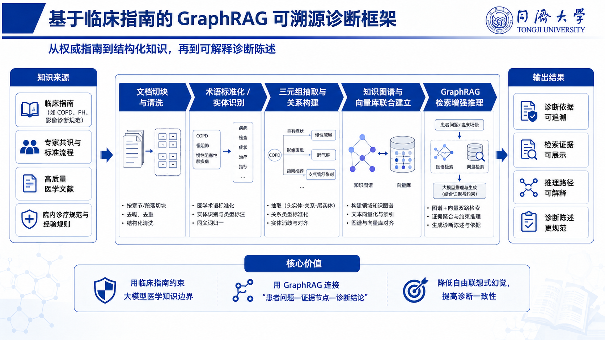
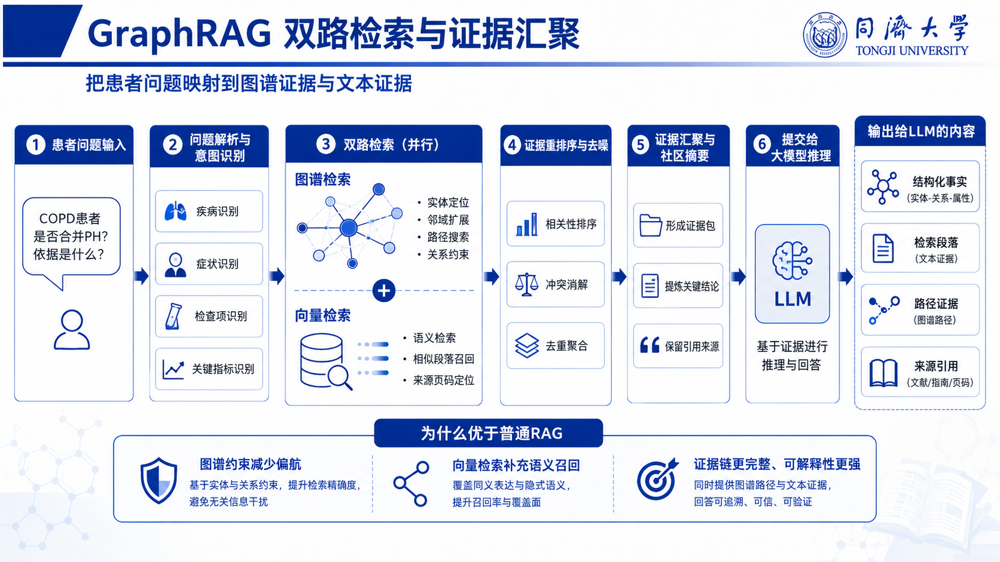
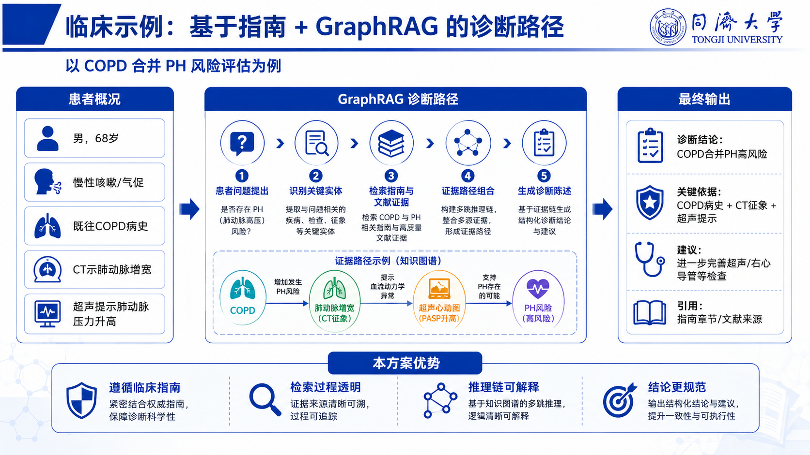
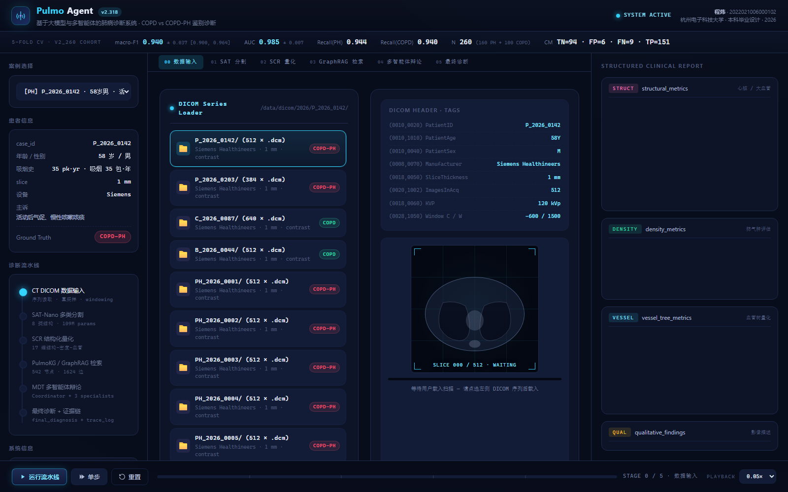
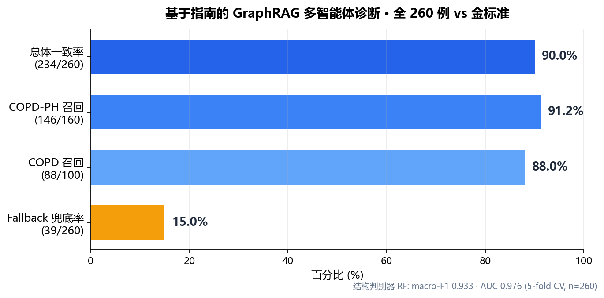

# 基于临床指南的 GraphRAG 多智能体肺动脉高压辅助诊断系统

> 同济大学 · 本科毕业设计 · COPD vs COPD-PH（肺病相关肺动脉高压）可溯源鉴别诊断
>
> 从权威指南（2022 ESC/ERS）到结构化知识图谱，再到**可解释、可溯源**的多智能体诊断陈述。

---

## 一、它解决什么问题

晚期 COPD 患者是否合并肺动脉高压（PH），是一个高价值但易误判的鉴别诊断。本系统把 **CT 结构定量（SCR 特征）** 与 **临床指南知识** 通过 **GraphRAG + 多智能体辩论** 结合起来：

- **接地（grounded）**：每条证据都检索自 2022 ESC/ERS 指南，**带页码**可溯源；
- **可解释**：三位"专科医生"智能体（呼吸 / 心内 / 影像）多轮辩论、投票、协调，输出完整推理链；
- **安全**：对不确定病例自动触发 **fallback 人工复核**，而非强行下结论。



---

## 二、系统架构

### 1) 知识 → 结构化 → 可溯源诊断
从临床指南（ESC/ERS、GOLD、ATS/ERS）切块清洗 → 实体/关系抽取 → 知识图谱 + 向量库联合建立 → GraphRAG 双路检索增强推理 → 4 类可解释输出（诊断依据 / 检索证据 / 推理路径 / 诊断陈述）。

### 2) GraphRAG 双路检索与证据汇聚


患者问题 → 解析与意图识别 → **图谱检索 + 向量检索并行** → 重排去噪 → 证据汇聚与社区摘要 → 提交大模型推理 → 结构化事实 / 文本证据 / 路径证据 / 来源引用。

### 3) 临床示例：COPD 合并 PH 风险评估


---

## 三、端到端演示（前端）

6 阶段流水线：`CT DICOM 载入 → SAT-Nano 分割 → SCR 结构化量化 → GraphRAG 检索 → 多智能体辩论 → 终判 + 证据链`。



> 本地起服务后访问，可加 URL 参数自动演示：`?autoplay=1&speed=2&case=P_2026_0203`

---

## 四、真实诊断样例（非编造，真实运行产出）

**示例：P_2026_0203（金标准 COPD-PH，三专家出现 2:1 分歧）**

**① GraphRAG 检索（Top-5，真实指南页码）**
- `KG#3644-1` score=0.92 · ESC/ERS 2022 PH Guidelines, p.3644 → COPD-PH +0.4
- `KG#3644-2` score=0.88 · ESC/ERS 2022 PH Guidelines, p.3644 → COPD +0.4
- `KG#3638-3` score=0.80 · ESC/ERS 2022 PH Guidelines, p.3638 → COPD-PH +0.3

**② 多智能体辩论（第 1 轮）**
- **PulmonologistAgent** → COPD-PH (conf=0.74)｜RF 概率>0.7 为主导判别，虽肺气肿不显著，倾向合并 PH。
- **CardiologistAgent** → COPD (conf=0.58)｜本队列 RV/LV<1.0 削弱右心受累证据，结构性增宽在晚期 COPD 不可靠，保守判 COPD。
- **RadiologistAgent** → COPD-PH (conf=0.72)｜肺动脉极度增宽叠加右房扩张，结合 RF>0.7，影像倾向 PH。
- **投票 COPD-PH:2 / COPD:1** → 达成共识（≥⌈n/2⌉）；分歧在 RV/LV=0.98<1.0，但 rf_proba=0.795 为本队列最高判别力指标。

**③ 终判**：`COPD-PH`（confidence=0.73，fallback=False），附完整 evidence_chain（数值 → 指南 → 页码）。

---

## 五、结果（全 260 例队列）



| 指标 | 数值 |
|---|---|
| 与金标准一致率 | **234 / 260 = 90.0%** |
| COPD-PH 召回 | 146 / 160 = 91.2% |
| COPD 召回 | 88 / 100 = 88.0% |
| Fallback 安全兜底率 | 39 / 260 = 15.0% |
| 26 例分歧中被 fallback 标记 | 14 例（安全网生效） |

底层 **结构判别器（RandomForest，17 维 SCR 特征，5 折 CV）**：macro-F1 0.933 · AUC 0.976。

> **关键方法学校准**：本队列均为晚期 COPD，PA/AO 与主肺动脉径普遍偏高（指南 `PA/AO>0.9→PH` 阈值在此无判别力）。系统因此以 **RF 校准先验 + 右心受累(RV/LV≥1) + 血管表型** 为主、PA/AO 仅作辅助——避免了对 PH 的系统性过判。

---

## 六、目录结构

```
frontend/                前端演示（纯静态 SPA，读取 3 个 JSON）
  index.html · app.js · styles.css
  data/cases.json        260 例 · 17 维 SCR 特征 + 金标准（匿名）
  data/kg.json           知识图谱 45 节点 / 57 边（页码级出处）
  data/debates.json      260 例 · GraphRAG 检索 + 多智能体辩论 + 终判
pipeline/                可复现的数据生成流水线
  build_kg.py            指南知识 → kg.json
  build_chunks.py        指南 PDF → chunks.jsonl（页码级向量语料）
  build_all_cases.py     SCR 特征 → cases.json（260 例）
  run_debate_pipeline.py 检索 + 多智能体辩论（DashScope qwen 版）
  merge_all.py           合并 / 校验 / 统计 / 部署
  chunks.jsonl           76 条 ESC/ERS 指南页码级证据块
  workflows/             多智能体编排脚本（Claude）
docs/                    架构图 / 截图 / 结果图
```

---

## 七、运行

```bash
# 前端（需通过 HTTP 打开，不能 file://）
cd frontend
python -m http.server 8099
# 浏览器访问 http://localhost:8099/  （或 ?autoplay=1&speed=2 自动演示）
```

流水线复现需要原始队列数据（含隐私，未公开）与 LLM 凭据；脚本通过环境变量读取，**不含任何密钥**。

---

## 八、技术栈与来源

- **知识来源**：2022 ESC/ERS 肺动脉高压诊疗指南（Humbert et al., *Eur Heart J* 2022;43:3618–3731）、GOLD 2024、ATS/ERS PH-CLD。指南文本仅作学术引用（短段落 + 页码出处）。
- **检索**：向量检索（语义余弦）+ 知识图谱路径检索（GraphRAG 双路）。
- **推理**：多智能体辩论（呼吸/心内/影像 + 协调员），LLM 经 LiteLLM 适配（Claude / 通义 Qwen 可切换）。
- **结构判别**：RandomForest，17 维 CT 结构-密度-血管特征（SCR）。

## 九、隐私声明

所有公开数据均已**匿名化**（合成示例 ID + 合成人口学画像），**不含任何真实患者姓名或可识别信息**；原始 CT 队列数据与凭据不在本仓库。
